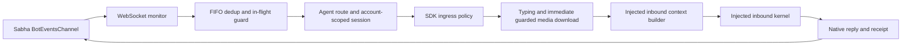

# Sabha channel architecture

Target: OpenClaw **2026.9.2**, Node **24.15+** (Node 25 requires 25.9+).
This is an external channel plugin, installed with id `sabha` and npm name
`@sabha-co/openclaw-sabha`. It has no standalone server or polling process.

## Loading and setup

`index.ts` uses `defineChannelPluginEntry`. It registers the channel and two
named tool factories synchronously. Factories defer config/client access until
execution and prefer the host's current tool-context config. CLI descriptors
are static; `src/cli.ts` loads only when a Sabha command is invoked.

`setup-entry.ts` uses `defineSetupPluginEntry` and `src/channel-setup.ts`.
The setup graph contains schema, account inspection, security, setup contract,
and wizard metadata. Transport, tools, draft streams, and the HTTP client do
not load statically through this entry. The wizard imports its client only
when an operator actually runs a network-dependent setup step.

`src/config-schema.ts` owns the Zod schema and UI hints. `src/metadata.ts` owns
CLI and tool declarations. `scripts/generate-manifest.mjs` projects those and
`src/setup-contract.ts` into `openclaw.plugin.json` and package setup fields.
`npm run manifest:check` detects drift; `prepack` builds and regenerates them.

Only `channels.sabha.accounts.<id>` contains credentials and bot identity.
Shared non-credential defaults remain on `channels.sabha`; account overrides
win, including `rooms` maps and allowlists. `defaultAccount` selects a bot.
There is no root-credential fallback, implicit configured bot, setup promotion,
boot migration, old-host shim, or old-session migration.

## Inbound path

`src/monitor-websocket.ts` handles ActionCable subscriptions, heartbeat,
subscribe races, and disconnect classification. `src/reconnect.ts` owns
backoff. The monitor reports `ready` only after BotEventsChannel subscription,
`recovering` after disconnect, and `blocked` for fatal failures. Abort closes
the transport and stops typing. Dedup is FIFO, capped at 2,000 entries with a
five-minute TTL; in-flight work survives reconnects. Failed turns release
the reservation; intentional admission drops do not run an agent.

`src/inbound.ts` supplies Sabha facts to `runtime.channel.inbound.run`.
Self echoes are ignored. Top-level rooms require a bot mention. DMs and
existing thread rooms do not require another mention. The ingress resolver
enforces account DM policy before typing or media download. Sabha's open DM
policy supplies the SDK-required wildcard; command authorization uses the
explicit account allowlist independently. Display names grant no authority.

The final agent/session/message/event binding is established before ingress
resolution. Its exact result goes to the injected context builder once.
Community installation needs no privileged state-store access or owner claim.
The kernel owns session recording, reply dispatch, modifying hooks, and the
single canonical `message_sent` observation after native settlement.

Attachments download immediately after admission because signed URLs expire.
The guarded downloader blocks private hosts unless the account explicitly
opts in. Local media facts use `saveMediaBuffer().path`, MIME type, and filename;
attachment-only input retains an empty agent body. Download errors are redacted
and nonfatal. Numeric native room/message ids survive context construction so
shared message-tool target autofill works. The sender envelope includes the
literal `@{id}` mention token. `user_created`/`user_deleted` are log-only and
never seed agent context or the mention-name cache.

## Sessions and threading

Fresh session keys come from the public SDK route builder. Accounts are always
isolated, including group rooms whose ids can overlap across Sabha servers:

| Conversation | Session |
| --- | --- |
| DM room | `agent:<agent>:sabha:<account>:direct:<room>` |
| Open/closed room | `agent:<agent>:sabha:group:<account>:<room>` |
| Existing thread room | Same group pattern using the thread room id |

Repeated events reuse the same conversation. Outbound session routing uses the
same helper; delivery-target resolution removes the account scope before the
wire call. A thread payload names its own room and parent message id, but does
not identify its parent room. We do not fabricate a parent session key.

New threaded replies use `sendMessage(parentRoom, text, { parentMessageId })`.
Sabha idempotently creates/finds the thread and returns its resolved room id.
Existing threads send directly to their room. DMs and `replyToMode: off` send
inline. Modes `first` and `all` both select the parent message's thread.

## Delivery and streaming

`src/draft-stream.ts` wraps the public `channel-outbound` draft lifecycle.
One message is created then edited from full accumulated snapshots. Finalization
in `src/delivery.ts` gates on `isAlive()`, never on an id that may still be
pending. It awaits the first send and final edit, then returns provider ids,
resolved room, visible text, and a normalized receipt.

A failed preview edit may be repaired directly. Replacement requires confirmed
preview deletion. A failed deletion preserves partial-delivery evidence. A send
attempt with no receipt is ambiguous and fails; it must never be described as
not dispatched or retried by the preview fallback. The system does not promise
exactly-once delivery after network failures.

Accepted remote attachments use the same guarded upload helper on the outbound
adapter and automatic reply path. Uploads retain `parentMessageId`, and multipart
replies preserve confirmed text/media receipts if a later upload fails.

Modifying `reply_payload_sending` or `message_sending` hooks disable eager
previews. Only hook-approved final content is then sent. Observer-only hooks
leave streaming enabled. Cancelled/silent turns clear pending previews. Typing
and draft resources settle on success, failure, and abort. Error text is logged
through `formatStreamError`, never posted through a hook-bypassing error path.

The channel also exposes a derived `message` adapter from its outbound adapter.
It advertises no durable final-delivery or privileged state capabilities.

## API and agent surfaces

All HTTP calls use `SabhaClient`: bearer auth, `/api/bots` paths, response parsing,
retry policy, and Markdown-to-Trix conversion live there. Only 429/502/503/504
retry; Retry-After is respected. Network errors do not retry non-idempotent POSTs.
WebSocket auth remains a query parameter and must be redacted in logs.

The shared `message` adapter owns send/edit/unsend/react/thread-reply/search/
member-info/read/reactions. Directory and resolver own room/user discovery.
Only `sabha_search_members` (room-scoped lookup) and `sabha_create_dm` lack SDK
slots and remain custom tools. No room/member administration tools are exposed.

`read` returns `{messages, hasMore, nextCursor}` with string ids, timestamp,
authorTag, author.username, and text for the CLI formatter. `reactions` projects
wire boosts into `{name, count, users, truncated}`. `search` retains its distinct
`results` envelope. Composite cursors go to the wire's `before` parameter.
Directory and resolver choose one account, never union overlapping tenant ids.

Prompt identity/mention rules remain in both inbound formatting hints and
message-tool hints because they serve different inbound/proactive render paths.
Do not inject whole API docs into prompts or ask agents to invent numeric targets.

## Verification

`npm test`, `npm run lint`, `npm run build`, and `npm run manifest:check` cover
local behavior. `npm run test:pack` installs the artifact in disposable state,
checks host metadata/config/CLI loading, and runs a real external host registry
against loopback-only fake Sabha HTTP and WebSocket servers. The agent producer
is synthetic; registration, admission, sessions, transport, hooks, and delivery
are real. Streaming, rewriting, cancellation, shared-message reaction routing,
replay dedup, and fatal-disconnect shutdown are checked.
No real bot messages, production reinstall, or publication happen in this test.
