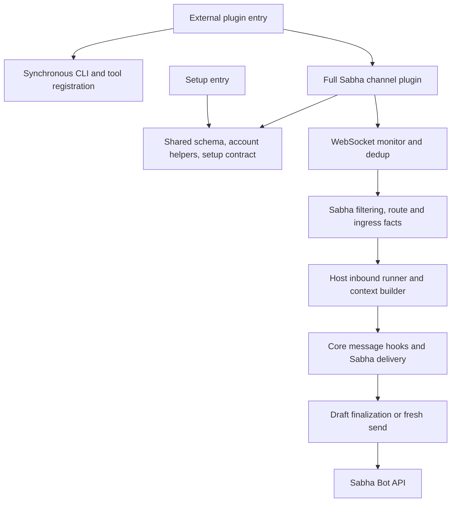
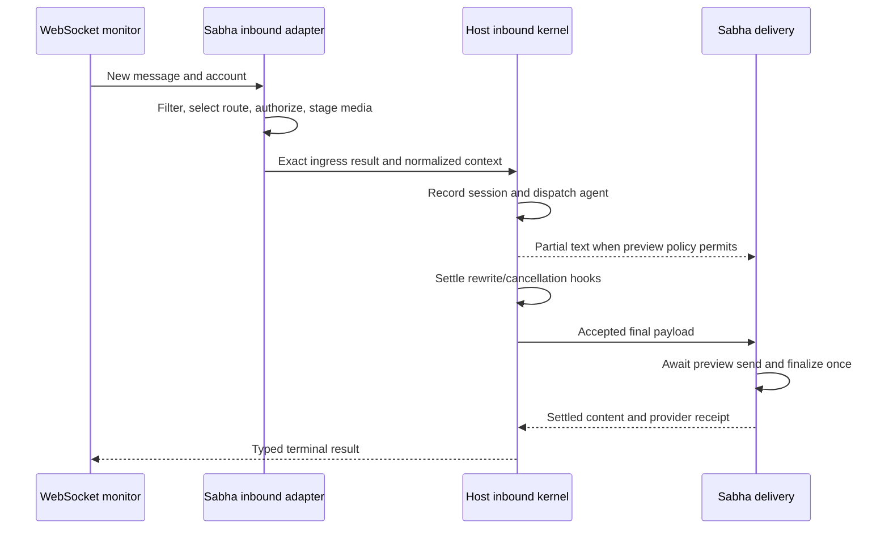
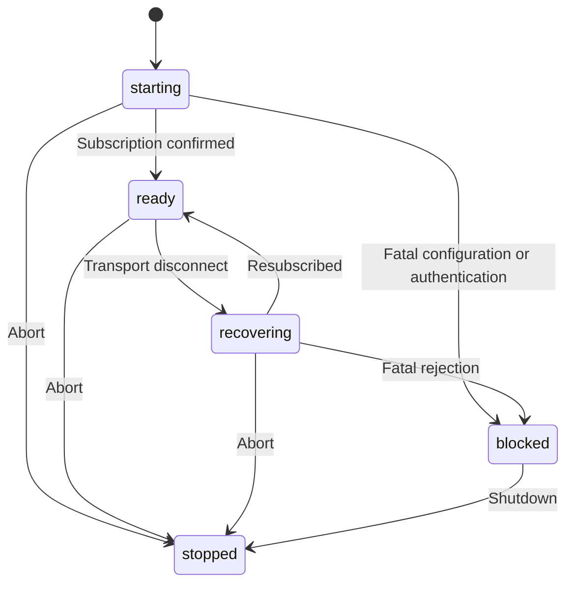

# Migrate Sabha to the OpenClaw 2 plugin architecture

## Goal Capsule

**Objective:** We can freshly install Sabha on the current stable OpenClaw, configure our bots, and chat with working tools, attachments, typing, and streamed replies.

**Means:** Adopt the supported external-plugin, setup, inbound, and outbound contracts in OpenClaw 2026.9.2 (KTD1–KTD6).

**Authority:** This document plans implementation. The current request authorizes reference-checkout updates and planning; it does not authorize deployment, publishing, or sending test messages to real rooms.

**Completion:** The packaged plugin passes the Verification Contract on the target host and provides the capabilities in R3–R7 from a fresh installation. Existing configuration and session history need not survive the upgrade. Changes to access policy or user-facing capabilities still require a product decision.

---

## Product Contract

### Summary

Upgrade `@sabha-co/openclaw-sabha` from the 2026.5.12 SDK to the modern plugin architecture, targeting the latest stable host, **2026.9.2**. Use a clean-install approach with no backward-compatibility requirement. Retain Sabha's messaging capabilities and make installation, discovery, setup, and runtime behavior verifiable from the actual npm artifact.

### Problem Frame

The plugin advertises host compatibility back to 2026.4.9 while compiling against 2026.5.12. Its Zod SDK import is removed in the stable target, and two other imports are now private helpers without public declarations. The inbound path manually assembles legacy context and dispatches through a retained compatibility facade. Tool registration also happens after the synchronous registration callback returns.

The user linked the 2026.8.1 release, named OpenClaw 2.0, and Basecamp's migration. Latest-stable discovery on September 8 found 2026.9.2, published September 5. The plan therefore uses the release-tag source as authority; the older Basecamp specification and moving online docs are supporting references.

The operator confirmed that this plugin is only used internally and can be reinstalled and configured from scratch. Existing installations, configuration layouts, session histories, and older host versions are not compatibility targets.

### Requirements

**Installation and configuration**

- R1. Support the stable 2026.9.2 host with a coherent dependency, engine, build, and compatibility declaration; fail clearly on older unsupported hosts.
- R2. Load through supported SDK contracts, register advertised tools during registration, and provide setup/discovery without starting transport services.
- R3. Keep plugin/channel id `sabha`, the npm package name, multi-account support, default-account selection, and join-URL setup. Fresh setup writes the canonical named-account configuration. Legacy root-level credentials and configuration promotion/migration are not supported; startup must not rewrite configuration.

**Conversation behavior**

- R4. Preserve inbound selection: self-authored events are ignored; top-level groups require a bot mention; DMs and existing threads do not. Enforce each account's DM policy and keep global user events outside agent-visible context.
- R5. Provide correct agent routing and conversation continuity within a fresh installation, numeric room/message context, sender mention syntax, room prompts, and immediate guarded attachment downloads. Use current SDK session routing without preserving old session keys or importing old history.
- R6. Preserve typing and one-preview streaming across inline replies, DMs, existing threads, and newly created reply threads. Respect host rewrite/cancellation hooks before exposing message content, and report actual delivery outcomes.
- R7. Preserve the shared message actions, directory and resolver behavior, and the two tools `sabha_search_members` and `sabha_create_dm`, including account isolation and existing pagination/result shapes.

**Operations**

- R8. Preserve WebSocket reconnect and deduplication behavior, represent account lifecycle accurately, and verify a normal externally installed package without privileged host state APIs.

### Scope Boundaries

This is an SDK migration, including the contract and packaging changes needed to make it reliable. Sabha's Bot REST API, ActionCable protocol, markdown-to-Trix conversion, and channel identity remain the platform boundary.

Deferred to follow-up work: durable restart replay/catalog nomination; SecretRef credentials; new pairing or ambient-room behavior; native approval/reaction workflows; progress cards and interactive presentation; channel/member administration. None is required to prove this migration. Existing text delivery must still handle the host's normal text fallback correctly. Backward-compatibility shims, legacy config promotion, session-history migration, and old-host test matrices are explicitly excluded; session-key changes needed for canonical SDK routing are in scope.

### Success Criteria

A clean package installation on 2026.9.2 discovers the channel, setup surfaces, CLI, and both tools; a real host-driven test dispatches and delivers through the new inbound path. Retain tests of current messaging capabilities and replace or remove tests that exist solely to enforce old configuration, entry, or session contracts. The targeted scenarios in the units below pass. No removed or private SDK imports, registration races, silent empty delivery receipts, or production configuration mutations remain.

---

## Planning Contract

### Research Baseline

| Source | Revision / observation | Consequence |
|---|---|---|
| Sabha | `d542d1d`; clean working tree at intake; SDK 2026.5.12 | Migration starts from the existing adapters and colocated tests. |
| OpenClaw | Checked out at stable tag `v2026.9.2`, commit `3928bad9badfcb6c7d140530435e806fb8092190`, in detached HEAD; original `main` preserved | Authoritative version, exports, inbound delivery, setup, and trust contracts. |
| Basecamp | Clean `main` fast-forwarded from `258c18f` to `9b72efd`; PR 170 merged as `73c75ae1` | Borrow direct external entry, separate setup plugin, generated metadata, inbound adapter, and pack-install verification. |
| Inline | Clean `main` pulled to `0d1d4238`; channel package under `openclaw/` | Useful contrasting lazy-entry pattern, synchronous registration module, and artifact/import-boundary tests. Its package targets 2026.8.2 with an upper bound excluding September. |
| Bundled channels | Telegram, Slack, and Mattermost inspected at `v2026.9.2`; all derive message adapters from outbound; all suppress eager previews with modifying hooks | Borrow those boundaries without their private imports or official-plugin privileges. |

Sibling references are under `../openclaw`, `../openclaw-basecamp`, and `../inline` relative to this repository. Only reference checkouts were updated; no host dependency installation or gateway restart is part of planning. OpenClaw's existing untracked `.github/workflows/pr-cache-cleanup.yml` must be preserved.

### Verified SDK Delta

| Current surface | Stable 2026.9.2 evidence | Planned treatment |
|---|---|---|
| `plugin-sdk/zod` in `src/channel.ts` | Absent from package exports; host depends on Zod 4.4.3 | Direct pinned Zod dependency; move schema into a setup-safe module. |
| `plugin-sdk/retry-runtime` in `src/retry.ts` | JavaScript-only private path | Use public `runtime-env.retryAsync`; preserve Sabha's HTTP classifier, delay settings, and Retry-After handling. |
| `plugin-sdk/target-resolver-runtime` in `src/resolver.ts` | JavaScript-only private path | Keep the small missing-credential/result wrapper in Sabha; preserve existing lookup/cache behavior. |
| `defineBundledChannelEntry` / setup entry | Still exported; docs describe bundled workspace use | Prefer documented external `defineChannelPluginEntry` and `defineSetupPluginEntry`, with fresh-process loading verified on the target host; remove the old workaround. |
| `registerFull` async IIFE | Entry callback is synchronous and also runs in tool-discovery mode without runtime setup | Register inert tool factories synchronously; read current config at execution time. |
| `inbound-reply-dispatch` | Still typed and exported as compatibility | Replace orchestration with `runtime.channel.inbound.run` and the host-injected context builder. |
| `channel-lifecycle.createFinalizableDraftLifecycle` | Compatibility facade remains; helper is exported by `channel-outbound` | Move import without replacing the proven draft state machine. |
| `OpenClawConfig` from `channel-core` | Still exported | Prefer focused `config-contracts` for config-only modules; this is not a hard removal. |
| `ChannelPlugin.setup` | Retained legacy adapter; host prefers `setupContract` | Replace with a channel-owned setup contract for fresh canonical configuration. |
| `MediaPath` context | Deprecated; modern context accepts ordered media facts | Pass local attachment facts through `media`. |
| Host state stores / ingress queue | `src/plugins/registry-runtime.ts` requires bundled or trusted official provenance | Do not introduce these APIs or bypass their trust checks. |

Other existing typed imports, including account helpers, directory, channel status, media, SSRF, and config-schema helpers, should be retained where valid. Do not treat every pre-2.0 import as broken. Stable dependencies are Zod **4.4.3** and TypeBox **1.3.18**, rather than Basecamp's older TypeBox pin.

### Key Technical Decisions

- KTD1. **Target 2026.9.2 as the minimum supported host.** Pin the development host and align peer, `openclaw.compat.pluginApi`, `openclaw.install.minHostVersion`, and build metadata. Do not support or test earlier host releases; no backward-compatibility matrix is required (KTD8). Keep the plugin's existing Node 24-or-newer posture, narrowed to host-supported ranges: `>=24.15.0 <25 || >=25.9.0`.
- KTD2. **Use the external-plugin entry contract and a genuinely separate setup plugin.** Basecamp and the stable entrypoint documentation support this shape. Remove the old bundled-entry workaround and unawaited registration IIFE. Verify the new entry in a fresh process on the target host. If a loader failure reproduces there, fix that current-host defect without retaining an old-host branch.
- KTD3. **Give the host ownership of inbound orchestration and admission.** Use the injected inbound runner/context builder, a Sabha adapter for platform facts, and `channel-ingress-runtime` for policy. Resolve final agent/session routing before minting `channelIngress` with its `contextBinding`; pass that exact result once into the host builder. Keep self/mention checks before downloads and typing. Do not invent owner authority or use `unsupported` as a shortcut.
- KTD4. **Keep transport, deduplication, and native delivery in Sabha.** The inbound kernel does not imply adopting the trust-gated durable queue. Preserve the FIFO TTL cache and in-flight reservation, unmarking on retryable processing failure. Let the typed terminal result distinguish an intentional drop from a failed dispatch so neither becomes a false success or an endless replay.
- KTD5. **Integrate streaming with the stable delivery settlement contract.** Keep `isAlive()`-based finalization and the in-flight first-send invariant. Derive the `message` adapter from the existing outbound adapter using `createChannelMessageAdapterFromOutbound`, without claiming durable capabilities. Use core-owned direct delivery and terminal observation, with real receipts and awaited settlement. Do not run message hooks twice. When rewrite/cancellation hooks are registered, buffer eager previews until the accepted payload reaches delivery; cancellation produces no visible draft. Without those hooks, retain incremental previews. The stable Mattermost implementation checks the typed-public `plugin-runtime.getGlobalHookRunner` for both modifying hooks; accept that specific export from the retained facade rather than inventing a private hook-inspection API.
- KTD6. **Generate cheap metadata from shared definitions.** Extract schema/UI hints and tool/CLI metadata into import-safe modules; generate manifest `channelConfigs`, `contracts.tools`, tool side-effect metadata, CLI declarations, and setup-field projections. Define the canonical fresh-install schema and explicit behavioral defaults; remove legacy credential layering and promotion lists/tests. Shared non-credential settings and named-account overrides remain supported. `sabha_search_members` is read-only; DM creation is side-effecting.
- KTD7. **Preserve agent-facing capability ownership.** Keep the nine message actions and directory/resolver slots; retain only the two SDK-gap tools. Pass fresh host config and the selected account into tool execution, and keep current room/message context for `react`, `reactions`, and threaded sends. No prompt asking the agent to fabricate a target.

- KTD8. **Clean installation replaces backward compatibility.** Only our internal installation uses this plugin, and reinstalling/reconfiguring with fresh sessions is acceptable (session-settled: user-directed — chosen over preserving existing installations: the sole operator can start fresh). No compatibility shims, legacy config promotion, old-session migration, or old-host support are required. This supersedes historical preservation instructions in AGENTS.md for the migration; update those instructions with the implementation.

### Assumptions

The target remains 2026.9.2. Current messaging capabilities and account isolation are the behavioral baseline; configuration layouts and session keys may change under KTD8. New 2.0 product features are separate work. This plan does not claim that unit tests or a local linked install establish package compatibility.

### High-Level Technical Design

These lifecycle labels describe behavior; implementation must use the exact supported snapshot fields, without inventing an SDK enum member for the stopped state.

### Sequencing

U1 establishes the build and import boundary. U2–U3 settle entry/setup contracts. U4 builds inbound facts and admission; U5 then closes delivery/streaming and terminal-result ownership. U6 verifies the shared action/tool paths. U7 completes lifecycle reporting. U8 proves and documents the assembled package. Do not introduce backward-compatibility bridges between units.

---

## Implementation Units

### U1. Establish the stable SDK and public imports

**Goal:** Compile against the chosen host using public imports only. **Requirements:** R1, R2, R7. **Dependencies:** None.

**Files:** `package.json`, `package-lock.json`, `src/channel.ts`, `src/retry.ts`, `src/resolver.ts`, `src/draft-stream.ts`, config-only imports across `src/`, `src/retry.test.ts`, `src/resolver.test.ts`, `src/draft-stream.test.ts`.

**Approach:** Apply the verified SDK delta and KTD1. Add direct Zod and align TypeBox; keep `.js` relative imports and Node16 module resolution. Implement only the small retry and missing-token seams needed to replace private imports. Do not add ambient declarations, SDK source aliases, or broad casts to hide removed APIs.

**Test scenarios:**

1. 429 and selected 502/503/504 responses retain the existing attempt budget and Retry-After behavior; 401/403/404 do not retry.
2. Disabled/missing-key accounts remain unresolved without network access; duplicate name queries share a call; lookup failure stays distinct from no match.
3. The draft lifecycle's first-send/finalize race behaves identically after its import moves.

**Verification:** Production compilation and existing relevant tests pass against the installed 2026.9.2 package, with no private-path imports in emitted output.

### U2. Make entry loading and registration deterministic

**Goal:** Discover and register the plugin without registration races or transport side effects. **Requirements:** R2, R7. **Dependencies:** U1.

**Files:** `index.ts`, `src/channel.ts`, new `src/runtime.ts` if needed for the SDK runtime store, `src/tools.ts`, new `index.test.ts`, `src/tools.test.ts`, new `scripts/verify-pack.sh`.

**Approach:** Apply KTD2. Register both factories synchronously with explicit names. Defer configuration/client access to execution and use host tool-context config where available. Keep CLI descriptors on the CLI metadata callback, with their implementation loaded only when invoked. Startup diagnostics must tolerate tool-discovery mode without assuming a runtime exists.

**Execution note:** Replace the historical cold-start workaround and prove the resulting artifact in a clean Node 24.15 process on the target host.

**Test scenarios:**

1. Tool discovery immediately returns both factories while runtime access is unavailable.
2. Repeated full/discovery registration neither opens sockets nor double-registers a tool.
3. Root help discovers `sabha`; invoking its subcommand loads the CLI and uses current configuration.
4. The packed entry imports and registers in a fresh process without `ERR_INTERNAL_ASSERTION`, including the minimum supported Node version.

**Verification:** Fresh-process package loading and mode-specific registration work without deferred registration callbacks.

### U3. Split setup and unify manifest/config metadata

**Goal:** Provide lightweight modern setup with one source for schema and metadata. **Requirements:** R2, R3. **Dependencies:** U1, U2.

**Files:** `setup-entry.ts`, new `src/channel-setup.ts`, new `src/config-schema.ts`, `src/channel.ts`, `src/setup-contract.ts`, `src/setup-wizard.ts`, `src/accounts.ts`, `src/account-inspect.ts`, `openclaw.plugin.json`, `package.json`, new `scripts/generate-manifest.ts`, new `src/manifest-contract.test.ts`, new `src/setup-entry.test.ts`, existing setup/account tests.

**Approach:** Apply KTD6 and KTD8; replace the legacy adapter with `defineChannelSetupContract` for fresh configuration. Publish only fields the implementation really accepts. Preserve join-URL registration through the wizard and existing Sabha CLI. Make the setup plugin reference shared metadata/config/security/setup only; keep `monitor.ts`, `ws`, draft streams, and tool implementations out of its transitive graph. Remove legacy promotion lists and root-credential fallback; retain shared non-credential settings, named-account overrides, and explicit default-account selection.

**Test scenarios:**

1. Importing setup metadata with transport modules unavailable succeeds; read-only inspection performs no network calls or config writes.
2. Wizard and existing CLI join setup write the same account fields, including multi-tenant base/API/WebSocket URLs.
3. Fresh named accounts and explicit default accounts resolve correctly. Root-level credentials are rejected by the canonical schema rather than silently inherited or migrated.
4. Generated manifest schema/UI hints, tool names, CLI descriptor, and package setup fields agree with runtime definitions; regeneration is deterministic.
5. Fresh `dmPolicy: open` and allowlist configurations work; account overrides and room prompts are represented consistently in the canonical schema.

**Verification:** Setup/import-boundary and metadata contract checks pass; host configuration validation and selected-channel setup help work on the artifact.

### U4. Move inbound routing and admission onto the kernel

**Goal:** Replace legacy envelope/dispatch assembly with canonical routing and policy for fresh sessions. **Requirements:** R4, R5, R7. **Dependencies:** U1–U3.

**Files:** `src/inbound.ts`, `src/monitor.ts`, `src/channel.ts`, `src/session.ts`, `src/messaging.ts`, `src/types.ts`, `src/inbound.test.ts`, `src/monitor.test.ts`, `src/messaging.test.ts`, new `src/inbound-kernel.test.ts`.

**Approach:** Apply KTD3–KTD4 and KTD8. Implement the adapter's ingest, classification, preflight, route/context resolution, and finalization responsibilities with the host-injected runner. Keep platform parsing in existing webhook helpers. Supply stable Sabha user ids as identity facts, account-specific policy, actual room/thread routing, numeric originating target/message context, channel identity/formatting hints, and ordered local media facts. Download permitted signed attachments before agent dispatch, after admission.

**Execution note:** Use the current SDK route/session contract as the source of truth. Replace legacy session helpers and fixtures where necessary; do not characterize or migrate old session keys. Verify room/thread separation, parent-thread relationships, and repeat-message continuity within fresh sessions.

**Test scenarios:**

1. DM, mentioned top-level group, and in-thread messages reach the configured agent and correct fresh conversation; repeated messages reuse that conversation, distinct threads stay separated, and unmentioned top-level messages and self echoes do not dispatch.
2. A disallowed DM sender is rejected before media downloads, typing, or dispatch; an allowed sender and an open-policy sender are admitted.
3. Two accounts with overlapping room/user ids retain distinct account routing and clients; a denied sender cannot gain command-owner privileges from a name or message field.
4. The exact ingress result is bound to the final agent/session/message/event; stale or mismatched facts are not reused.
5. Attachment-only input retains an empty body and a media fact; download failure remains nonfatal with a redacted diagnostic; private hosts remain blocked by default.
6. Numeric message/room tool context, sender `@{id}`, room prompt, and thread metadata survive the builder; global user events never enter an agent context.
7. A real SDK runner test records and dispatches one event through a fake native delivery boundary; mocked PascalCase context capture alone is insufficient.

**Verification:** Modern inbound tests pass with one recording/dispatch owner and canonical fresh-session routing fixtures.

### U5. Settle streaming and delivery under the new contracts

**Goal:** Retain incremental replies without duplicate sends, hook bypass, or false delivery success. **Requirements:** R5, R6, R8. **Dependencies:** U4.

**Files:** `src/monitor.ts`, `src/inbound.ts`, `src/draft-stream.ts`, `src/channel.ts`, `src/types.ts`, `src/client.ts` only if adapter result handling requires it, `src/draft-stream.test.ts`, `src/monitor.test.ts`, `src/inbound-kernel.test.ts`, `src/channel.test.ts`.

**Approach:** Apply KTD5. Wire the derived message adapter alongside the existing outbound adapter, advertising only proven text/media/live behavior. Preserve the current native finalization branches and return actual provider ids and resolved room targets. Await the preview's final settlement before terminal observation. Fail visibly on malformed/empty send responses rather than returning an empty message id. Preserve visible receipt information when a partial delivery later fails. Keep typing cleanup tied to admission, completion, cancellation, failure, and abort.

**Test scenarios:**

1. Final output arrives while the first preview send is unresolved: one message is created and then finalized.
2. Alive preview, dead preview with edit success, edit failure with delete/fresh-send recovery, and dead stream with no preview preserve the intended room/thread.
3. Inline, DM, existing-thread, and new-thread paths honor `replyToMode`; media and text retain real provider receipts.
4. A rewrite hook's replacement is the only visible content; a cancellation hook leaves no draft or final message. Each logical payload receives at most one hook application and terminal observation.
5. A rejected final edit or native send remains a failure; a visible preview followed by failure is reported as partial delivery rather than no delivery.
6. Typed dispatch failure releases the dedup reservation; intentional admission drops do not replay indefinitely. Abort stops typing and prevents stale draft updates.
7. Missing media input produces an intentional no-send outcome; a send that was attempted but returned an empty/unknown response remains a delivery failure. Never label an ambiguous attempted send as provably not dispatched.

**Verification:** Real-kernel delivery tests prove receipt and hook ownership in addition to the existing stream race suite.

### U6. Verify all agent-facing outbound paths

**Goal:** Keep actions, directories, resolvers, and custom tools usable on the stable host. **Requirements:** R7. **Dependencies:** U2, U3, U5.

**Files:** `src/channel.ts`, `src/message-actions.ts`, `src/tools.ts`, `src/directory.ts`, `src/resolver.ts`, `src/messaging.ts`, and their existing colocated tests; package smoke fixtures under `scripts/` as needed.

**Approach:** Apply KTD7. Audit target gating and CLI formatting against stable host source, rather than the old hashed bundle paths in AGENTS.md. Preserve id-only mutations, implicit versus explicit threading, and normalized read/reaction envelopes. Ensure both tool factories use invocation-time account/config context; explicit account selection keeps existing precedence.

**Test scenarios:**

1. Discover and execute `send`, `edit`, `unsend`, `react`, `thread-reply`, `search`, `member-info`, `read`, and `reactions` against a stub Sabha endpoint with correct wire targets.
2. Inbound `react` and `reactions` calls without an explicit room obtain the correct current target; proactive calls with numeric targets work.
3. Search/read cursor and room/author aliases remain correct; read/reactions render through the host formatter with string ids and normalized author fields.
4. Directory/resolver operations stay on the selected default or explicit account, never unioning conflicting tenants.
5. Both custom tools are discoverable before a gateway starts, then execute with changed current config and correct account context.

**Verification:** Shared host entry points and direct adapter tests agree; any residual external-plugin CLI limitation is reproduced and documented, rather than hidden behind a new Sabha-only tool.

### U7. Align account lifecycle and operational reporting

**Goal:** Make status and restart behavior accurately reflect the WebSocket monitor. **Requirements:** R3, R8. **Dependencies:** U4, U5.

**Files:** `src/channel.ts`, `src/monitor.ts`, `src/monitor-websocket.ts`, `src/typing.ts`, `src/doctor.ts`, `src/types.ts`, `src/channel.test.ts`, `src/monitor.test.ts`, `src/monitor-websocket.test.ts`, `src/typing.test.ts`, `src/doctor.test.ts`.

**Approach:** Project starting/ready/recovering/blocked behavior into stable snapshot fields and existing connection status. Distinguish configured, enabled, connected, and running; currently the account snapshot computes enabled from credential presence. Fatal startup errors must be explicit. Preserve AbortSignal cleanup and existing dedup/reconnect limits. Do not advertise account-isolated restarts or durable delivery capabilities without evidence.

**Test scenarios:**

1. Configured-but-disabled accounts are reported disabled and open no socket.
2. Subscription confirmation marks readiness; reconnect and authentication rejection produce recovering/blocked status instead of stale connected state.
3. Abort during startup/reconnect/active generation closes sockets, subscriptions, timers, and typing work; another account remains unaffected.
4. Read-only doctor and status do not canonicalize config or expose bot keys/WebSocket query credentials.

**Verification:** Status transitions match simulated transport lifecycle, and all cleanup promises settle.

### U8. Prove the artifact and document the upgrade

**Goal:** Establish an honest minimum-host support claim and reproducible release checks. **Requirements:** R1–R8. **Dependencies:** U1–U7.

**Files:** `package.json`, `package-lock.json`, `.github/workflows/ci.yml`, `.github/workflows/npm-publish.yml`, `scripts/verify-pack.sh`, `README.md`, `AGENTS.md`, `docs/ARCHITECTURE.md`, `docs/sdk-overview.md`, `docs/sdk-channel-plugins.md`, `docs/sdk-entrypoints.md`, `docs/TEST-PROMPTS.md`.

**Approach:** Point package discovery/setup entries at compiled shipped files and add a deterministic prepack build/metadata check. Keep SDK imports external; do not bundle OpenClaw. Add artifact installation and runtime inspection with isolated state/config to CI and the release gate. Preserve the repository's OIDC publish workflow. Document reinstall-and-reconfigure as the upgrade path, including the lack of old-session continuity, and remove obsolete migration/promotion guidance. Update the vendored documentation or explicitly mark its source version so old SDK snapshots cannot override the installed target's contract.

**Test scenarios:**

1. An archive produced from a clean checkout contains both entrypoints and all referenced modules; manifest/package versions and compatibility metadata agree.
2. Installing that archive on 2026.9.2 with fresh state discovers Sabha, validates its schema, shows CLI/setup help, and inspects the runtime without importing from this checkout or an old global extension.
3. The supported minimum Node 24.15 and a current supported Node runtime load the package; any broader declared runtime remains compatible with the host engine range.
4. A disposable host instance and fake Sabha WebSocket/HTTP server exercise inbound dispatch, delivery, disconnect/reconnect, tools, and shutdown with both account configurations.

**Verification:** CI and release gates run the Verification Contract. A real-server smoke test can follow once a test bot/room is explicitly designated; never reuse production configuration automatically.

---

## Verification Contract

No tests, builds, or runtime probes were run during planning. Implementation must distinguish unit, host integration, and real-server evidence.

| Check | Evidence required |
|---|---|
| `npm run lint` | Current ESLint checks pass without migration-specific blanket suppression. |
| `npm run build` | Clean declaration/JS emit against pinned 2026.9.2, including setup entry. |
| `npm test` | Existing behavior suites plus the new registration, setup, manifest, ingress, and delivery cases pass. |
| Manifest generation/check | Deterministic output; checked-in metadata matches runtime definitions. |
| `npm pack` + package smoke | All entry files exist in the archive; fresh host installation, setup/config validation, tool discovery, and runtime inspection succeed. |
| Real host + fake Sabha integration | At least one event traverses the actual registered host runtime, not solely a mocked inbound dispatcher; no privileged-plugin trust assumption. |
| Optional designated real-server smoke | One DM, one mentioned group message, one thread reply, attachment, reaction, and reconnect verified with a test bot; results recorded separately. |

### Risks and implementation-time checks

- **Fresh-process loading:** Prove KTD2 against the actual package on the target host; a successful unit import does not settle Node's loader behavior. Historical loader compatibility is not a separate requirement.
- **Trust and participant evidence:** The stable host permits community-channel guest admission but restricts owner elevation and state APIs. Verify the real external installation and accept the host's authority boundary; do not substitute a forged owner flag or standalone context-builder fallback.
- **Fresh sessions:** Old session keys/history may be abandoned under KTD8. Verify continuity and account/room/thread isolation within the new installation; no history migration or old/new key comparison is required.
- **Hook-aware preview behavior:** Streaming may be buffered on gateways with modifying hooks. This is an intentional compatibility requirement of the stable host, while ordinary hook-free streaming remains the regression target.
- **Ambiguous native sends:** The migration does not establish exactly-once delivery across network failures. A server may accept a send before its response is lost; preserve that uncertainty and never use the host's not-dispatched error marker after a send/finalization call has begun.
- **Metadata activation:** Keep existing activation behavior unless an explicit lazy policy is proven to preserve standalone CLI/tool discovery. Copying Basecamp's `onStartup: false` is not necessary for this upgrade.
- **Support claims:** A compile-time pass cannot prove optional runtime injection, external CLI activation, or cold artifact loading. These remain implementation checks with named coverage in U2/U6/U8.
- **Installation:** Validate the package with fresh state, then reinstall and configure the internal bot from scratch when implementation is authorized. No rollback migration or preservation of the old plugin installation is required. This planning decision does not itself delete current state or unrelated gateway data.

---

## Definition of Done

All implementation units satisfy their verification outcomes; the assembled npm artifact meets R1–R8 on the declared host floor. No obsolete import bridges, unawaited registrations, unused prototype paths, or stale architecture guidance remain. Fresh canonical configuration and session routing work, no legacy-install compatibility code remains, delivery settlement has one owner, and limitations are documented with reproduced evidence. Publishing and production rollout require a subsequent explicit instruction.

---

## Sources

- [OpenClaw 2.0 release overview](https://docs.openclaw.ai/releases/2026.8.1) — original migration context.
- [Stable v2026.9.2 release](https://github.com/openclaw/openclaw/releases/tag/v2026.9.2) and [package exports/dependencies](https://github.com/openclaw/openclaw/blob/v2026.9.2/package.json) — target selection and import audit.
- [Stable entrypoint contracts](https://github.com/openclaw/openclaw/blob/v2026.9.2/docs/plugins/sdk-entrypoints.md) — synchronous registration, tool-discovery behavior, external/setup entries.
- [Stable SDK subpath catalog](https://github.com/openclaw/openclaw/blob/v2026.9.2/docs/plugins/sdk-subpaths.md) — public versus private helpers and retained compatibility facades.
- [Stable inbound contract](https://github.com/openclaw/openclaw/blob/v2026.9.2/docs/plugins/sdk-channel-inbound.md) and [ingress contract](https://github.com/openclaw/openclaw/blob/v2026.9.2/docs/plugins/sdk-channel-ingress.md) — context binding, media facts, delivery settlement, and preview hooks.
- [Stable setup contract](https://github.com/openclaw/openclaw/blob/v2026.9.2/docs/plugins/sdk-setup.md) — declarative fields and configuration promotion.
- [Stable registry runtime](https://github.com/openclaw/openclaw/blob/v2026.9.2/src/plugins/registry-runtime.ts) — state trust gate and community-channel authority boundary.
- [Basecamp PR 170](https://github.com/basecamp/openclaw-basecamp/pull/170) and `../openclaw-basecamp/docs/upgrades/openclaw-2.0-spec.md` — migration rationale, import-safe setup, generated manifest, and artifact verification.
- `../inline/openclaw/src/index.ts`, `../inline/openclaw/src/runtime-register-api.ts`, `../inline/openclaw/src/inline/package-artifact.test.ts` — lazy entry, synchronous full registration, and package-boundary precedent.
- `../openclaw/extensions/mattermost/src/channel.ts`, `../openclaw/extensions/mattermost/src/mattermost/monitor-turn.ts`, `../openclaw/extensions/telegram/src/bot-message-dispatch.preview-hook-safety.test.ts`, `../openclaw/extensions/slack/src/monitor/message-handler/dispatch-setup.ts` at `v2026.9.2` — derived message adapter, inbound runner, and hook-aware preview behavior.
- `AGENTS.md`, `docs/MESSAGE-TOOL-HINT-DEPENDENCE-PLAN.md`, `docs/READ-AND-REACTIONS-ACTIONS-PLAN.md`, `docs/plans/ID-ONLY-CLIENT-MIGRATION-PLAN.md` — current messaging invariants and historical context; KTD8 supersedes their legacy configuration/session compatibility requirements.
